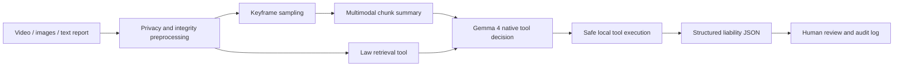

# Gemma 4 Traffic Liability Assistant

基于附件研究报告整理的 GitHub 风格工程骨架，用于展示 **Gemma 4 原生函数调用（Native Function Calling）** 与 **多模态（Multimodal）事故证据处理** 在交通事故责任辅助判定中的核心实现方式。

> 定位：本项目输出的是责任判定辅助建议，不替代交警、保险理赔人员、司法鉴定或法院裁判。

## Highlights

- Native Function Calling：通过 `processor.apply_chat_template(..., tools=...)` 注册本地工具，由 Gemma 4 决定是否调用视频元数据、预处理、法规检索和责任比例校准工具。
- Multimodal Processing：对事故视频抽帧，对现场图片和文本报案信息做脱敏，再将关键帧作为图像输入交给 Gemma 4 做分段事实摘要。
- Evidence-first Reasoning：最终结论必须包含责任档位、比例建议、证据链、法条依据、不确定项与人工复核标记。
- GitHub-ready Layout：核心代码、示例、测试和技术报告分离，便于继续扩展成实际 PoC。

## Repository Layout

```text
.
├── README.md
├── docs/
│   └── technical-report.md
├── examples/
│   └── run_case.py
├── pyproject.toml
├── requirements.txt
├── src/
│   └── gemma4_liability_assistant/
│       ├── __init__.py
│       ├── model.py
│       ├── pipeline.py
│       ├── schemas.py
│       └── tools.py
└── tests/
    └── test_tool_calls.py
```

## Quick Start

```bash
python -m venv .venv
source .venv/bin/activate
pip install -r requirements.txt
export GEMMA_MODEL_ID="google/gemma-4-12B-it"
python examples/run_case.py --video demo_case.mp4 --image scene_1.jpg --image scene_2.jpg
```

如果本机没有 GPU 或没有安装 Gemma 4 权重，建议先阅读代码与技术报告；`tests/` 中的解析与校准测试不依赖模型权重。

## Core Flow



## Native Function Calling Example

核心代码位于 [src/gemma4_liability_assistant/pipeline.py](src/gemma4_liability_assistant/pipeline.py)。Gemma 4 使用工具 schema 生成函数调用，系统只执行 allow-list 中注册过的工具：

```python
assistant_output = self.client.generate(
    messages=tool_messages,
    tools=self.tool_schemas,
    enable_thinking=False,
    max_new_tokens=512,
)

for call in parse_tool_calls(assistant_output):
    tool_result = call_safe_tool(call.name, call.arguments, self.tool_registry)
    tool_messages.append({
        "role": "tool",
        "name": call.name,
        "content": json.dumps(tool_result, ensure_ascii=False),
    })
```

## Multimodal Example

Gemma 4 对关键帧进行分段事实摘要，避免一次性塞入全量视频帧：

```python
messages = [
    {"role": "system", "content": "Only describe visible facts. Return JSON."},
    {
        "role": "user",
        "content": [
            {"type": "text", "text": f"Frame timestamps: {time_hints}"},
            *[{"type": "image"} for _ in images],
        ],
    },
]

summary = self.client.generate(messages=messages, images=images)
```

## Technical Report

完整模型选型与架构设计见 [docs/technical-report.md](docs/technical-report.md)。

## References

- Google DeepMind Gemma 4 overview: https://deepmind.google/models/gemma/gemma-4/
- Gemma function calling docs: https://ai.google.dev/gemma/docs/capabilities/function-calling
- Gemma docs hub: https://ai.google.dev/gemma/docs
