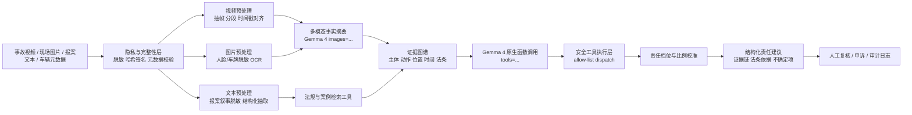

# 技术报告：基于 Gemma 4 的多模态交通事故责任辅助判定系统

## 1. 摘要

本方案基于附件《交通事故责任判定预测模型与基于 Gemma 4 的多模态判责系统设计》整理，目标不是让模型成为“自动终局裁判”，而是把 Gemma 4 作为 **多模态证据编排与法律推理中枢**：先抽取视频、图片、文本中的可见事实，再通过原生函数调用接入视频元数据、法规检索、责任比例校准和审计工具，最后生成可复核的结构化责任建议。

核心结论是：主工作模型选择 **Gemma 4 12B Unified**；高并发预处理可选 **Gemma 4 E4B**；复杂争议件复核可选 **Gemma 4 31B**。这一路线比单一大模型端到端输出更稳，因为责任判定同时包含事实识别、时间线重建、法规适用、证据可信性判断和人工复核边界。

## 2. 模型选型理由

### 2.1 为什么主模型选择 Gemma 4 12B Unified

Gemma 4 12B Unified 适合作为主工作模型，原因有四点：

1. **能力覆盖完整**：附件方案指出 Gemma 4 支持原生函数调用、system role、长上下文和多模态能力，适合把视频切片、法规检索、责任比例校准等工具挂接到同一推理流程中。
2. **上下文容量适合证据编排**：事故案件通常包含多段视频摘要、现场图片、报案文本、法规条款和工具返回结果。12B Unified 的长上下文能力适合承载“证据图谱 + 法规依据 + 责任候选”的综合输入。
3. **精度与成本更平衡**：相比 E4B，12B 更适合处理复杂责任归因；相比 31B，12B 更适合在线或准在线主流程，不会把所有流量压到高延迟复核模型上。
4. **工程上可量化部署**：附件报告给出的内存估算显示，12B Unified 在 8-bit 或 Q4 量化后可以进入 24GB 级单卡 PoC 范围，更适合团队快速构建试点。

### 2.2 推荐组合

| 系统角色 | 推荐规格 | 用途 | 选择理由 |
|---|---|---|---|
| 在线预处理与分诊 | Gemma 4 E4B | 视频分段摘要、低风险案件分流、OCR/ASR 调度 | 延迟低、成本低，适合高并发前置层 |
| 主责任辅助判定 | Gemma 4 12B Unified | 证据整合、法规检索整合、责任档位建议 | 能力与成本平衡，适合作为核心工作模型 |
| 复杂争议复核 | Gemma 4 31B | 多方责任、伤亡案件、证据冲突、低置信度复核 | 推理上限更高，但不适合承担全量在线流量 |

### 2.3 为什么不让 31B 处理全部流量

责任判定的主要风险不是“模型参数量不够”，而是证据链不完整、法条引用错误、遮挡或单视角导致的事实不确定。视频抽帧、元数据校验、法规检索、比例校准和审计日志本来就是工具链任务。让 31B 承担所有流量会提高成本与延迟，却不能替代证据完整性、工具验证和人工复核。

## 3. 总体架构



## 4. Native Function Calling 设计

Gemma 4 的价值不在于“直接凭感觉输出责任比例”，而在于按需调用可核验工具。核心工具包括：

| 工具 | 输入 | 输出 | 用途 |
|---|---|---|---|
| `extract_video_metadata` | 视频路径 | FPS、帧数、时长、SHA-256 | 建立证据完整性与时间轴基础 |
| `preprocess_multimodal_case` | 视频、文本、图片 | 脱敏文本、脱敏图片、关键帧、元数据 | 统一案件输入 |
| `retrieve_law_articles` | 查询文本 | 候选法规条款 | 防止模型编造法条 |
| `calibrated_ratio_head` | 责任档位、参与方 | 比例模板 | 避免 LLM 输出不稳定小数 |

实现方式上，系统通过 `transformers.utils.get_json_schema` 将 Python 函数转为工具 schema，并传入：

```python
self.client.generate(
    messages=tool_messages,
    tools=self.tool_schemas,
    enable_thinking=False,
)
```

模型输出工具调用后，系统只执行注册表中的函数：

```python
tool_result = call_safe_tool(call.name, call.arguments, self.tool_registry)
```

这种 allow-list 分发方式避免了 `globals()` 或动态执行带来的安全风险，也方便把每次工具调用写入审计日志。

## 5. Multimodal 处理设计

多模态处理采用“分段摘要 + 全局时间线”的策略：

1. 视频按固定间隔或事故关键点抽帧，保留时间戳。
2. 每 4 张左右关键帧组成一个 chunk，作为 `images=` 输入给 Gemma 4。
3. Gemma 4 只输出可见事实：参与主体、动作、道路环境、遮挡和不确定项。
4. 系统把多个 chunk 汇总为全局时间线，再进入责任判定阶段。

这样设计的原因是：长上下文不等于把所有原始帧一次性塞给模型。交通事故责任判断需要时序一致性和证据可追溯，分段摘要能降低视觉 token 压力，也能让每条事实回指到具体时间段。

## 6. 责任输出策略

最终输出不采用散文式“模型意见”，而采用结构化 JSON：

```json
{
  "accident_detected": true,
  "parties": ["甲车", "乙车"],
  "liability_bucket": "主责",
  "recommended_ratio_bucket": "主责",
  "evidence_chain": [
    {
      "timestamp_sec": 7.0,
      "fact": "乙车在接近碰撞前未体现足够制动距离",
      "source": "video_frame_007"
    }
  ],
  "supporting_articles": [
    {
      "article_id": "road-traffic-law-43",
      "title": "安全车距"
    }
  ],
  "uncertainties": ["缺少精确车速数据", "单视角无法确认前车急刹原因"],
  "human_review_required": true,
  "model_opinion": "现有证据更支持后车未保持安全距离，但仍需人工复核。"
}
```

比例由外部模板或校准头生成，例如“主责”映射为 `70/30`，“同责”映射为 `50/50`。生产环境可把 `calibrated_ratio_head` 替换成 XGBoost、FT-Transformer、AMFormer 或本地法规规则引擎。

## 7. 审计与合规

系统默认保留以下审计信息：

- 原始视频哈希与元数据。
- 脱敏后的文本和图片路径。
- 每次工具调用的名称、参数、结果预览。
- 模型版本、prompt 阶段和最终结构化输出。
- 触发人工复核的原因。

Gemma 4 的 thinking mode 可以在内部实验中用于提升复杂推理质量，但法律或保险场景不应把原始思维链作为审计证据。应归档的是证据、法条、工具结果、模型版本和不确定项。

## 8. 评价指标

建议分三组评价：

| 指标组 | 建议指标 |
|---|---|
| 感知指标 | 事故首帧时间误差、关键主体 bbox IoU、关键动作 F1、时序一致性 |
| 法律指标 | 责任档位 Accuracy / Macro-F1、责任比例 MAE、法条命中率、引用准确率、证据链完整性 |
| 运营指标 | 人工改判率、复议推翻率、低置信度占比、平均处理时延、每案推理成本 |

## 9. 风险边界

- 不把系统声明为自动终局判责器。
- 人伤、亡人、多方事故、证据缺失或模型输出冲突时强制人工复核。
- 法规库必须按地区维护，避免法域漂移。
- 图片和视频需要加入篡改检测、来源校验和证据链签名。
- 任何责任建议都必须能回指到具体证据和法规候选。

## 10. 参考资料

- 附件：`deep-research-report (1).md`
- Google DeepMind Gemma 4 overview: https://deepmind.google/models/gemma/gemma-4/
- Gemma function calling docs: https://ai.google.dev/gemma/docs/capabilities/function-calling
- Gemma docs hub: https://ai.google.dev/gemma/docs
